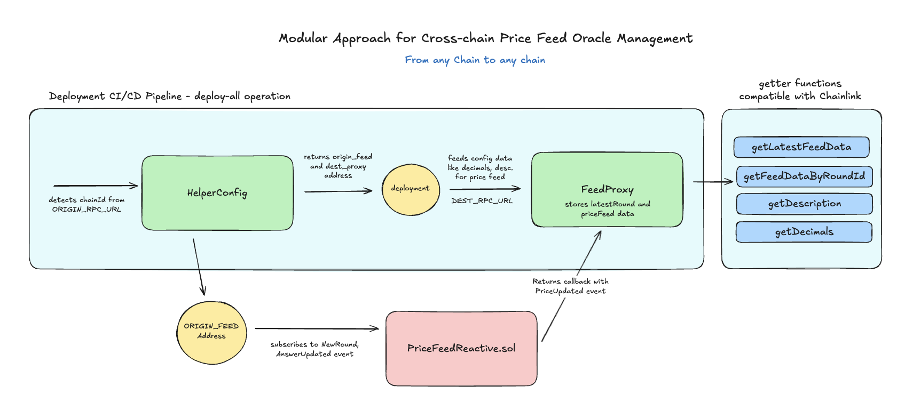

# Cross-chain Oracle Price Feed

## Overview

Chainlink Price Feeds are critical infrastructure for DeFi, perpetual exchanges, lending protocols, derivatives, and risk-managed smart contracts. However, not all chains have native Chainlink deployments.

**Note:** This project is using `ETH/USD` as an example for cross-chain testing and deployment. The project can be further expanded to include more data feeds supported by Chainlink.

This project solves that by:

- Reading canonical feeds from an origin network (e.g., Ethereum, Sepolia, Arbitrum)
- Tracking `NewRound(uint256,address,uint256)` and `AnswerUpdated(int256,uint256,uint256)` in a particular chain in Reactive Contract
- Updating a destination-side FeedProxy contract, by managing logs and sending callbacks from Reactive Contract
- Exposing `getLatestFeedData()` similar to real Chainlink aggregator `getLatestRoundData()` in the `src/FeedProxyCallback.sol` contract



## Contracts

**Reactive Contract**: `src/PriceFeedReactive.sol` subscribes to `NewRound(uint256,address,uint256)` and `AnswerUpdated(int256,uint256,uint256)` events via **ANSWER_UPDATED_TOPIC0** and **NEW_ROUND_TOPIC0** on any particular chain. When the NEW_ROUND_TOPIC0 and ANSWER_UPDATED_TOPIC0 event is received, it updates the states like roundId to the RC contract and returns the callback the FeedProxy destination contract `src/FeedProxyCallback.sol`. The callback event includes:
`PriceUpdate` which includes updated price and roundId with timestamp.

**PriceFeed ProxyCallback Contract**: `src/FeedProxyCallback.sol` manages the receival of the callback from the Reactive contract. It is deployed in a particular chain where Chainlink pricefeed is not available. `src/FeedProxyCallback.sol` ensures the Chainlink-compatible pricefeed data to this chain. It includes the following functions: `getLatestFeedData()`, ` getLatestFeedDataByRoundId(uint80)``getDecimals() `, and `getDescription()`

**HelperConfig Contract**: `script/build/HelperConfig.s.sol` helps to identify the current chainid and returns the compatible `NetworgConfig(priceFeedAddress, destProxyAddress, chainid)` for that chain. It helps for quick deployment setup.

**DeployPriceFeedOrigin.s.sol**: This contract gets the original Chainlink price feed address, and stores data like `decimals`, `description` and `feed_address` for the `FeedProxyCallback.sol` contract deployment.

**DeployFeedProxyCallback.s.sol**: Deploys the `FeedProxyCallback.sol` on a particular chain.

## Contract CI/CD Deployments

This project supports deployments for origin and callback address with a single command.

### ENV Variables (.env.example)

```
ORIGIN_RPC_URL=""
DEST_RPC_URL=""
REACTIVE_RPC_URL=""
PRIVATE_KEY=""
FEED_DESTINATION="" (Deployed contract address of FeedProxyCallback.sol)
```

**Step 1**: Deploy FeedProxyCallback.sol on a destination chain. Make sure to setup all .env variables

```bash
make deploy-all
```

**Step 2**: Deploy PriceFeedReactive.sol using the following command

```bash
make deploy-reactive CHAIN_ID="" PRICE_FEED=""
```

Note: Make sure to have `FEED_DESTINATION` contract address in .env variable

### Testing contract

Run the following commands to get latest pricefeed (roundId, price and updatedAt data), decimals, description and getting source origin address

```bash
make read-latestFeed
make read-decimals
make read-description
make read-originFeed
```

### Resume/Pause RC Contract

```bash
make pause-reactive REACTIVE_ADDR=""
make resume-reactive REACTIVE_ADDR=""
```

### Testing the entire workflow with mock Chainlink contracts

**Step 1)** Deploying mock Chainlink feed address on any particular chain. The `test/mocks/MockV3Aggregator.sol` has a function `updateAnswer(int256)` that lets to change the `answer` and emits the `AnswerUpdated` event.

```bash
make deploy-testing
```

This command deploys both the mock feed and feed callback contracts.

You can get deployed `mock_feed` address and `feed_destination` address from logs. You can also get mockfeed address from `script/artifacts/feed.json => feedProxy`.

Save the `feed_destination` address in the .env variable.

**Step 2)** Deploy the `PriceFeedReactive.sol` contract with mock_feed address attached.

```bash
make deploy-reactive CHAIN_ID="" PRICE_FEED=""
```

Here:
`PRICE_FEED`= the deployed MOCK_FEED_ADDR
`FEED_DESTINATION` → comes from the .env file (your deployed FeedCallback contract)

**Step 3)** Run the test setup

```bash
make send-mockUpdate MOCK_ADDR="" ANSWER=""
make read-latestFeed
```

The latestFeed must return the updated answer with roundId updated. Congrats!
